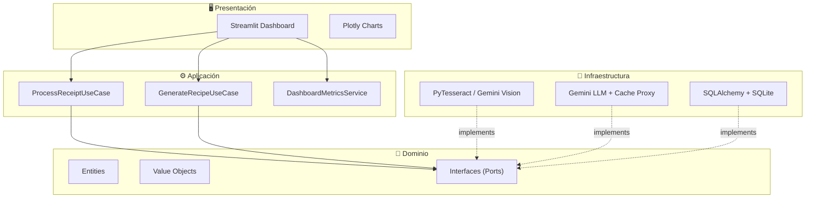

<p align="center">
  <h1 align="center">🥗 SaveTheFood AI</h1>
  <p align="center">
    <strong>Sistema inteligente de mitigación de desperdicio alimentario</strong>
  </p>
  <p align="center">
    
    
    
    
    
    
  </p>
</p>

---

## 📋 Descripción

**SaveTheFood AI** ingiere recibos de supermercado mediante OCR, extrae los productos
alimenticios, estima sus fechas de vencimiento, y genera recetas inteligentes que
priorizan los ingredientes próximos a vencer — todo a través de un motor RAG
alimentado por Google Gemini.

El sistema calcula métricas de impacto económico (USD ahorrados) y ambiental
(CO₂ evitado) para motivar al usuario a reducir el desperdicio alimentario.

---

## 🏗️ Arquitectura

El proyecto implementa **Clean Architecture** con cuatro capas concéntricas
y la regla de dependencia estricta: las dependencias apuntan **solo hacia adentro**.



### Patrones de Diseño

| Patrón | Implementación |
|--------|----------------|
| **Strategy** | OCR intercambiable (PyTesseract ↔ Gemini Vision) |
| **Factory** | Construcción de entidades Recipe desde output LLM |
| **Proxy** | Cache O(1) sobre llamadas a Gemini API |
| **State** | Lifecycle del recibo: Uploaded → Processing → Parsed → Completed |

---

## 🧮 Estructuras de Datos

| # | Estructura | Complejidad | Uso en el Sistema |
|---|------------|-------------|-------------------|
| 1 | **List** | O(1) append | Texto OCR raw antes del parsing |
| 2 | **Stack (LIFO)** | O(1) push/pop | Undo de correcciones manuales de OCR |
| 3 | **Queue (FIFO)** | O(1) enq/deq | Pipeline de procesamiento de recibos |
| 4 | **Hashmap** | O(1) lookup | Vida útil de 40+ alimentos |
| 5 | **Heap (PQ)** | O(log N) | Priorización por fecha de vencimiento |
| 6 | **Árbol N-ario** | O(D) | Taxonomía jerárquica de alimentos |
| 7 | **Grafo Bipartito** | O(1) edge | Recomendación de recetas por cobertura |

---

## 📁 Estructura del Proyecto

```
SaveTheFood-AI/
├── src/
│   ├── domain/          # Entidades, Value Objects, Interfaces (sin dependencias)
│   ├── application/     # Use Cases, DTOs, Services
│   ├── infrastructure/  # OCR Adapters, Gemini API, SQLAlchemy
│   ├── presentation/    # Streamlit UI, Pages, Components
│   └── shared/          # Data Structures, DI Container, Utils
├── tests/               # Unit, Integration, E2E
├── docs/                # Arquitectura, API Specs, Plan de Fases
├── scripts/             # Migraciones, Seeds
├── config/              # Pydantic Settings
├── data/                # Raw, Processed, SQLite DB
├── assets/              # Archivos estáticos
└── notebooks/           # Experimentación Jupyter
```

> Cada subcarpeta contiene su propio `README.md` con responsabilidades y estado
> de implementación. Ver `README_AI.md` para contexto optimizado para LLMs.

---

## 🚀 Instalación

### Prerrequisitos

- Python 3.11+
- Tesseract OCR ([instalación](https://github.com/tesseract-ocr/tesseract))
- Google Gemini API Key

### Setup

```bash
# 1. Clonar el repositorio
git clone https://github.com/tu-usuario/savethefood-ai.git
cd savethefood-ai

# 2. Crear entorno virtual
python -m venv .venv
source .venv/bin/activate  # Linux/Mac
.venv\Scripts\activate     # Windows

# 3. Instalar dependencias
make install
# o manualmente:
pip install -e ".[dev]"

# 4. Configurar variables de entorno
cp .env.example .env
# Editar .env con tu GEMINI_API_KEY

# 5. Inicializar base de datos
make migrate

# 6. Ejecutar la aplicación
make run
```

### Docker

```bash
# Construir y ejecutar
docker-compose up --build

# La aplicación estará en http://localhost:8501
```

---

## 🧪 Testing

```bash
# Todos los tests
make test

# Solo tests unitarios
make test-unit

# Solo tests de integración
make test-integration

# Lint + type checking
make lint
```

---

## 🗓️ Roadmap

| Fase | Descripción | Estado |
|------|-------------|--------|
| **Fase 1** | Core Architecture, Interfaces, Data Structures, Tests | ✅ Completada |
| **Fase 2** | OCR Real, Gemini API, Pipeline Integration | 🔧 En progreso |
| **Fase 3** | Streamlit Dashboard, Plotly Charts, E2E Tests | 🔲 Pendiente |

Ver [`docs/PHASES.md`](docs/PHASES.md) para el plan detallado con entregables granulares.

---

## 🤝 Contribución

### Conventional Commits (Estricto)

```
feat(domain): add nutritional scoring to FoodItem
fix(infrastructure): handle timeout in Gemini API calls
docs(shared): update data structures documentation
test(unit): add edge case tests for ExpirationHeap
```

### Reglas

1. **Nunca** modificar la capa Domain sin aprobación del arquitecto.
2. **Siempre** programar contra interfaces, nunca contra implementaciones concretas.
3. **Actualizar** el README de la capa correspondiente al completar un módulo.
4. **Tests** obligatorios para toda nueva funcionalidad.

---

## 📄 Licencia

Este proyecto está bajo la Licencia MIT. Ver [LICENSE](LICENSE) para más detalles.

---

<p align="center">
  <em>Construido con 🧠 Clean Architecture • 🤖 Google Gemini • 📊 Streamlit</em>
</p>
