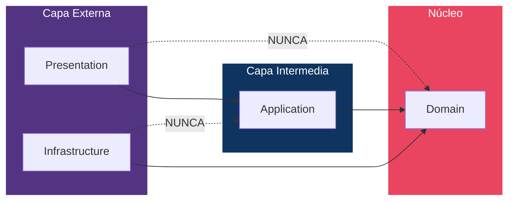
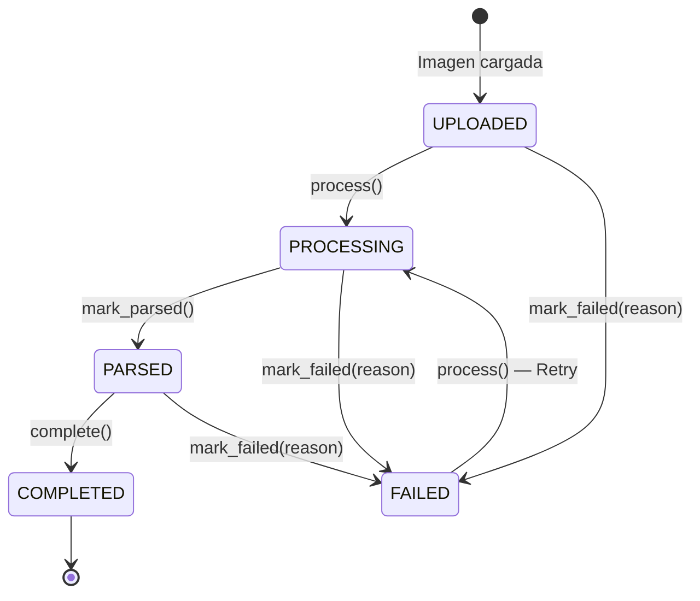

# 📋 Arquitectura — SaveTheFood AI

## Diagrama de Flujo de Arquitectura (Mermaid)

```mermaid
graph TB
    subgraph Presentation["🖥️ Presentation Layer"]
        APP[Streamlit App]
        SIDEBAR[Sidebar Component]
        CHARTS[Plotly Charts]
        INV_PAGE[Inventory Page]
        REC_PAGE[Recipes Page]
        VM[ViewModels]
    end

    subgraph Application["⚙️ Application Layer"]
        UC_RECEIPT[ProcessReceiptUseCase]
        UC_RECIPE[GenerateRecipeUseCase]
        METRICS[DashboardMetricsService]
        DTOS[DTOs]
        FACTORY[RecipeFactory]
    end

    subgraph Domain["🧠 Domain Layer"]
        E_RECEIPT[Receipt Entity<br/>State Pattern]
        E_FOOD[FoodItem Entity]
        E_RECIPE[Recipe Entity]
        IF_OCR[OCRProviderInterface]
        IF_LLM[LLMProviderInterface]
        IF_REPO[RepositoryInterfaces]
    end

    subgraph Infrastructure["🔌 Infrastructure Layer"]
        TESS[PyTesseractAdapter]
        GVISION[GeminiVisionAdapter]
        GLLM[GeminiLLMProvider]
        PROXY[GeminiCacheProxy]
        DB[SQLAlchemy Repositories]
        ORM[ORM Models]
    end

    subgraph Shared["🛠️ Shared Layer"]
        DI[DependencyContainer]
        DS_HEAP[ExpirationHeap]
        DS_STACK[UndoStack]
        DS_QUEUE[ProcessingQueue]
        DS_MAP[ShelfLifeMap]
        DS_TREE[FoodCategoryTree]
        DS_GRAPH[RecipeGraph]
    end

    APP --> UC_RECEIPT
    APP --> UC_RECIPE
    APP --> METRICS
    INV_PAGE --> DS_HEAP
    INV_PAGE --> DS_STACK
    CHARTS --> DS_TREE
    REC_PAGE --> DS_GRAPH

    UC_RECEIPT --> IF_OCR
    UC_RECEIPT --> IF_REPO
    UC_RECEIPT --> E_RECEIPT
    UC_RECIPE --> IF_LLM
    UC_RECIPE --> IF_REPO
    UC_RECIPE --> FACTORY

    IF_OCR -.->|implements| TESS
    IF_OCR -.->|implements| GVISION
    IF_LLM -.->|implements| PROXY
    PROXY -->|wraps| GLLM
    IF_REPO -.->|implements| DB

    DI -->|wires| TESS
    DI -->|wires| GVISION
    DI -->|wires| PROXY
    DI -->|wires| DB

    style Domain fill:#1a1a2e,stroke:#e94560,color:#fff
    style Application fill:#16213e,stroke:#0f3460,color:#fff
    style Infrastructure fill:#0f3460,stroke:#533483,color:#fff
    style Presentation fill:#533483,stroke:#e94560,color:#fff
    style Shared fill:#2c2c54,stroke:#474787,color:#fff
```

## Dependency Rule — Diagrama de Capas Concéntricas

```mermaid
graph LR
    subgraph Outer["Capa Externa"]
        P[Presentation]
        I[Infrastructure]
    end

    subgraph Middle["Capa Intermedia"]
        A[Application]
    end

    subgraph Core["Núcleo"]
        D[Domain]
    end

    P --> A
    I --> D
    A --> D
    P -.->|NUNCA| D
    I -.->|NUNCA| A

    style Core fill:#e94560,stroke:#fff,color:#fff
    style Middle fill:#0f3460,stroke:#fff,color:#fff
    style Outer fill:#533483,stroke:#fff,color:#fff
```

## Flujo de Estado del Receipt (State Pattern)

```mermaid
stateDiagram-v2
    [*] --> UPLOADED: Imagen cargada
    UPLOADED --> PROCESSING: process()
    PROCESSING --> PARSED: mark_parsed()
    PROCESSING --> FAILED: mark_failed(reason)
    PARSED --> COMPLETED: complete()
    PARSED --> FAILED: mark_failed(reason)
    FAILED --> PROCESSING: process() — Retry
    UPLOADED --> FAILED: mark_failed(reason)
    COMPLETED --> [*]
```
